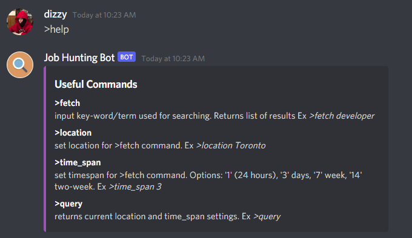

# Job Search Discord BOT 

Add custom discord bot to a server to support your members in a job search. Use it from Software Developer Internship -> Walmart Warehouse Associate!

## Description

Runs a scrape of custom indeed.com queries using the 'requests' and 'BeautifulSoup' modules. Formatted and displayed in your custom discord server using discord.py API. Scrapes Indeed.com for up to the latest 15 jobs based on some search criteria. 

Currently in the works
* Adding more search websites (LinkedIn, Glassdoor, etc)
* Implementing pagination
* Use with Amazon AWS EC2 server to avoid client hosting
* Refining criteria and search results
* Adding more discord commands for personalization.
* Logging bot & user actions 

## Getting Started

* Invite the BOT to your server [**HERE**](https://discord.com/api/oauth2/authorize?client_id=867137012603289631&permissions=2148002880&scope=bot)

### Dependencies

* Verify you have BeautifulSoup and discord.py install with:
* `pip install BeautifulSoup`  & `pip install discord.py` respectively

### Installing

* Clone or unzip the downloaded package.
* Any modifications needed to be made to files/folders

### Executing program

* Execute main.py to initiate the bot. To verify if working correctly, look for `We have logged in as Job Hunting Bot#2287` in the terminal shortely after it's ran.
* In discord server, bot should now be appearing online. Type ">help" to view current list of accessible commands!

## Authors

Contributors names and contact info

Matthew Benson
3rd Year Computer Science Major @ Brock University
ex. [LinkedIn](https://www.linkedin.com/in/matthew-benson-59b1a31b7/)

## References

App Icon 
* [ClipArtMax](https://www.clipartmax.com/middle/m2i8d3d3G6N4N4G6_magnifying-glass-icon-for-kids-new-york-times-app-icon/)
